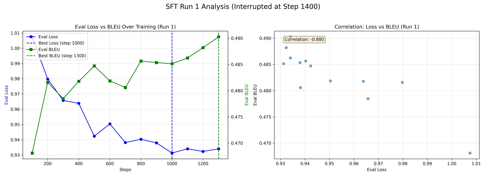
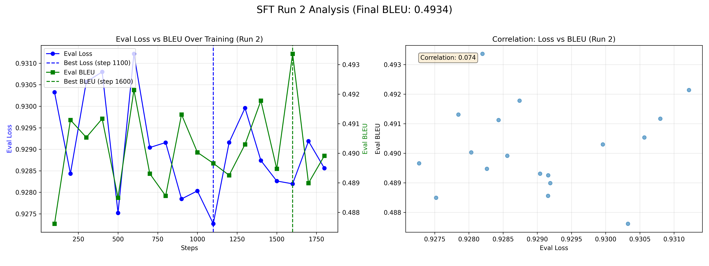
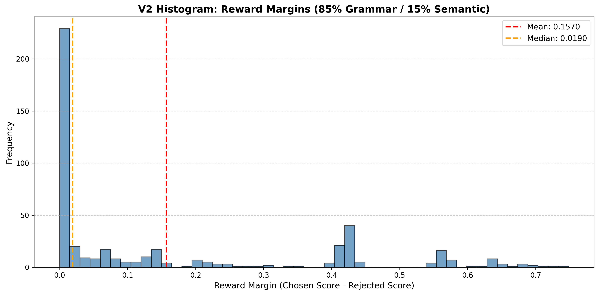
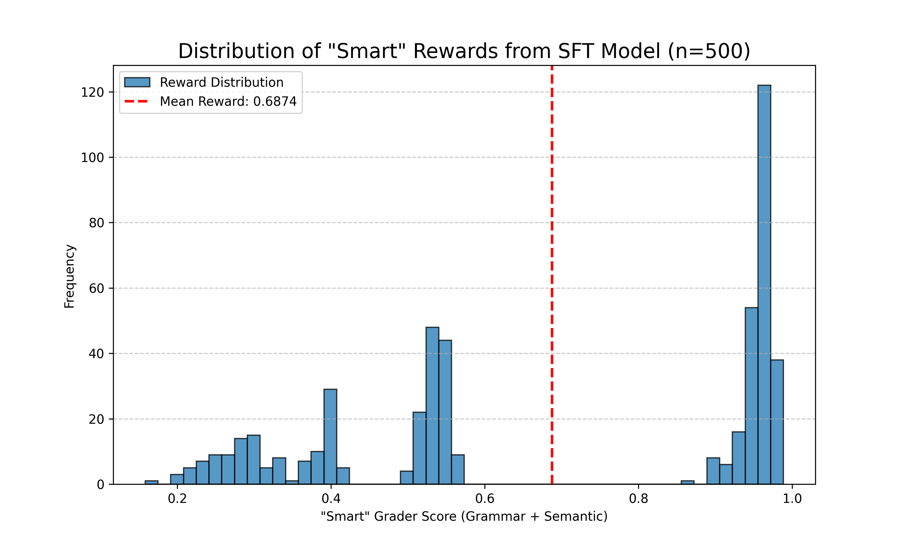

# A Systematic Comparison of SFT, DPO, and GRPO for Aligning SmolLM-135M on Grammatical Error Correction

An educational exploration comparing preference optimization methods for grammatical error correction (GEC) using `HuggingFaceTB/SmolLM-135M`.

[](https://www.python.org/downloads/)
[](https://pytorch.org/)
[](https://huggingface.co/transformers/)
[](https://huggingface.co/docs/trl)

### ➡️ [**View Notebook with All Outputs (HTML)**](./preference_optimization_pipeline_WITH_OUTPUTS.html)
*Note: The main notebook file (`.ipynb`) in this repository has its outputs cleared to allow GitHub to render. Please use the HTML link above to see the full analysis, plots, and logs.*

---

## 🎯 Overview

This project is a **comparative study** of three alignment approaches for a Grammatical Error Correction (GEC) task. The goal was to see if modern preference optimization techniques could measurably improve upon a strong, well-tuned baseline.

I compare three methods:
1.  **Supervised Fine-Tuning (SFT)**: The traditional, robust baseline.
2.  **Direct Preference Optimization (DPO)**: An "offline" experiment to align the model with a custom "smart" reward.
3.  **Group Reward Preference Optimization (GRPO)**: An "online" experiment to test a different alignment paradigm.

---

## 🏆 Key Results

| Method | BLEU Score | Δ from SFT | Key Qualitative Finding |
| :--- | :--- | :--- | :--- |
| **SFT (Baseline)** | **0.4934** | - | Strong performance, but suffers from **repetitive loops**. |
| **DPO (Offline)** | 0.4931 | -0.05% | **Failed to improve.** The static dataset was flawed. |
| **GRPO (Online)** | **0.4942** | **+0.18%** | **SUCCESS: Fixed the SFT model's repetitive loop failures.** |

---

## 📈 Main Findings & Analysis

This project's value is in the *iterative process* and the analysis of *why* each method performed the way it did.

### 1. SFT: A Strong but Flawed Baseline
I first established a strong baseline by training the `SmolLM-135M` model.

* **Key Debug:** I initially struggled to get "completion-only" loss working. The `DataCollatorForCompletionOnlyLM` was removed in `trl` version 0.20. This collator masked the user prompt to train only on the LM’s completion. In newer versions, this logic is built-in: tokens are automatically ignored during loss computation if `completion_only_loss` is set in the `SFTConfig`. While simpler, this new approach is less flexible and **requires** a dataset with distinct `prompt` and `completion` fields, which was the key fix.
* **Final SFT:** After fixing this and resuming an interrupted run, I trained a strong baseline model that achieved a **0.4934 BLEU score**.
* **The Flaw:** Qualitative analysis revealed a major flaw: the SFT model would get stuck in **catastrophic repetitive loops** on long, complex prompts.

### 2. Experiment 1: Direct Preference Optimization (DPO)
My first alignment experiment was "offline" DPO. To define "good," I built a `CombinedRewardGrader` that judged corrections on:
1.  **Grammar (85%):** Using `language-tool-python`.
2.  **Semantic Fidelity (15%):** Using a `SentenceTransformer` to check similarity to the *original* (broken) prompt.

* **Critical Finding:** The DPO experiment **failed to improve** on the SFT baseline (0.4931 BLEU).
* **Why?** The analysis of the DPO dataset was the key. It showed my "smart" grader *preferred the SFT model's output 56% of the time*. The SFT model's "safe, literal" fixes (e.g., "are" -> "is" in a nonsense sentence) were scored higher than the `Ground Truth`'s "heavy rewrites," which were (correctly) penalized for high semantic drift.
* **Conclusion:** The DPO trainer had no clear signal to learn from. This was a valuable finding about the difficulty of designing reward models.

### 3. Experiment 2: Group Reward Preference Optimization (GRPO)
My second experiment, GRPO, tested a completely different, "online" approach. This method avoids the "SFT vs. Ground Truth" problem entirely.

* **Strategy:** I used the `GRPOTrainer` with a dataset of *prompts only*.
* **The Online Loop:** At each training step, the model would:
    1.  **Generate** 5 diverse candidate corrections (using `do_sample=True`).
    2.  **Grade** all 5 "live" candidates with my `CombinedRewardGrader`.
    3.  **Learn** from this ranked list.
* **Sanity Check:** Before training, I ran a sanity check and confirmed that my grader produced a wide, learnable distribution of scores (not just a single spike), which is essential for this method.
* **Result:** The "online" GRPO experiment was a success. It achieved the highest BLEU score (**0.4942**, a +0.18% gain over SFT) and, most importantly, the qualitative analysis proved it **fixed the SFT model's catastrophic repetitive loop failures** (e.g., in examples 334 and 337) where DPO had no effect.
---

## 📊 Key Plots

<table align="center" style="border:none;">
  <tr style="border:none;">
    <td align="center" style="border:none;">
      <b>1. SFT Baseline (0.4934 BLEU)</b><br>
      
      
      <br><i>Analysis: SFT Run 1 (top) was interrupted. Run 2 (bottom) was resumed, leading to the final 0.4934 BLEU score.</i>
    </td>
    <td align="center" style="border:none;">
      <b>2. DPO Experiment (The Finding)</b><br>
      
      <br><i>Analysis: Proved DPO would fail. The "smart" grader preferred the SFT model 56% of the time.</i>
    </td>
    <td align="center" style="border:none;">
      <b>3. GRPO Sanity Check (The Solution)</b><br>
      
      <br><i>Analysis: Confirmed the "online" GRPO method had a wide, learnable reward signal.</i>
    </td>
  </tr>
</table>

---

## 📂 Repository Structure

```

.
├── models/
│   ├── sft_final_v2_resumed/     # Final 0.4934 BLEU SFT model
│   ├── dpo_smart_model_v2/       # Failed DPO model
│   └── grpo_smart_online_model/  # Final GRPO model
├── analysis/
│   ├── dpo_smart_dataset_v2.csv  # The flawed DPO dataset
│   └── (other analysis files)
├── images/
│   ├── (all .png plots)
├── preference_optimization_pipeline.ipynb  # The main notebook
├── preference_optimization_pipeline_WITH_OUTPUTS.html # Full notebook with logs
└── README.md                       # You are here

```

---

## 🚀 How to Run

1.  **Clone Repository:**
    ```bash
    git clone https://github.com/kulsoom-abdullah/preference-optimization-gec
    cd preference-optimization-gec
    ```

2.  **Install System Dependencies (Java):**
    The `language-tool-python` library requires a Java 8+ runtime.
    ```bash
    sudo apt-get update && sudo apt-get install -y default-jre
    ```

3.  **Install Python Dependencies:**
    (You can generate this file from your environment)
    ```bash
    pip install -r requirements.txt
    ```
    *Key libraries: `torch`, `transformers`, `trl`, `datasets`, `evaluate`, `language-tool-python`, `sentence-transformers`, `fast_edit_distance`.*

4.  **Run Notebook:**
    Open and run the `preference_optimization_pipeline.ipynb` notebook. The `get_or_evaluate_score` caching utility is *not* used in this final version, so cells must be run in order.

---

## 📚 References
* **Models:** [SmolLM-135M](https://huggingface.co/HuggingFaceTB/SmolLM-135M)
* **Dataset:** [Grammarly CoEdit (GEC Task)](https://huggingface.co/datasets/grammarly/coedit)
* **TRL:** [Hugging Face TRL Library](https://huggingface.co/docs/trl)
* **GRPO Paper:** [Group Reward Preference Optimization](https://arxiv.org/abs/2405.01894)
* **Grader Tools:** [LanguageTool](https://languagetool.org/) & [SentenceTransformers](https://sbert.net/)

---

**Happy learning! 🚀**

*This project demonstrates preference optimization techniques through a practical example. The notebook is designed to be educational - run it, modify it, and explore different hyperparameters to deepen your understanding of alignment methods.*