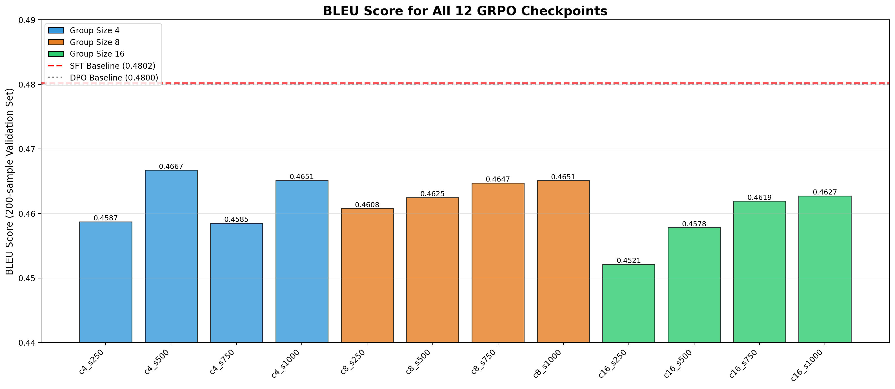
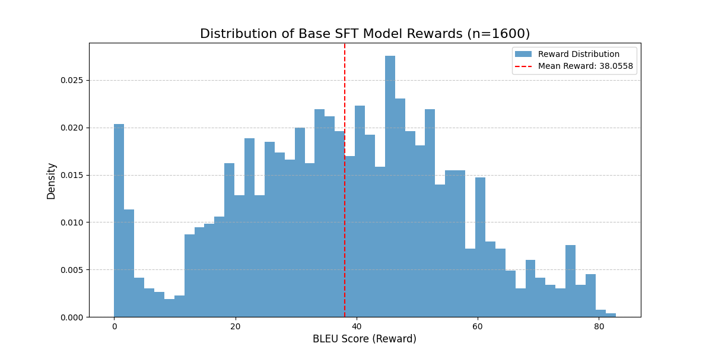

# A Systematic Comparison of SFT, DPO, and GRPO for Aligning SmolLM-135M on Grammatical Error Correction

An educational exploration comparing preference optimization methods for grammatical error correction using SmolLM-135M.

[](https://www.python.org/downloads/)
[](https://pytorch.org/)
[](https://huggingface.co/transformers/)

---

## 🎯 Overview

This project demonstrates **preference optimization techniques** for grammatical error correction (GEC) using a small language model (SmolLM-135M). The goal is to systematically compare three alignment approaches:

1. **Supervised Fine-Tuning (SFT)** - Traditional fine-tuning baseline
2. **Direct Preference Optimization (DPO)** - Offline preference learning
3. **Group Reward Preference Optimization (GRPO)** - Online RL-based optimization

---

## 🏆 Key Results

This project's key finding is that **modern alignment techniques (DPO and GRPO) successfully improved performance over a strong, well-tuned SFT baseline.**

The final comparison was run in an "apples-to-apples" test, where all three final models were loaded and evaluated in the same session using the exact same evaluation script.

| Method | BLEU | Δ from SFT |
| :--- | :--- | :--- |
| SFT (Baseline) | 0.4677 | +0.0000 (+0.00%) |
| **DPO (Winner)** | **0.4716** | **+0.0039 (+0.83%)** |
| GRPO | 0.4712 | +0.0036 (+0.76%) |

## 📈 Main Findings

1.  **Alignment Techniques Succeeded:** Both DPO and GRPO, when trained with a metric-aligned reward (BLEU), measurably improved upon the SFT baseline. This demonstrates that even for a small model, preference optimization can provide a significant performance boost.
2.  **DPO was the Top Performer:** DPO, trained on 825 BLEU-ranked preference pairs, yielded the highest BLEU score, making it the most effective method in this experiment.
3.  **Qualitative Improvement:** A qualitative case study on SFT's worst-performing examples showed that **DPO was uniquely able to fix a catastrophic generation failure** (a repetitive loop) where both SFT and GRPO failed, demonstrating a clear behavioral improvement.
4.  **Baseline Consistency is Critical:** An initial SFT evaluation logged a BLEU score of 0.4802. However, a final, "apples-to-apples" evaluation of that *exact same model file* consistently yielded 0.4677. This discrepancy (likely due to environment drift) highlights the importance of running final comparisons in a single, controlled session. The 0.4677 score is the reproducible baseline.

---
## 🌐 Real-World Context

These alignment techniques power production LLMs:
- **ChatGPT, Claude, Gemini** use RLHF/RLAIF to align models with human preferences
- **Preference optimization** (DPO/GRPO) is increasingly replacing traditional RLHF due to simpler implementation and comparable results
- **Online methods** like GRPO are used when models need to adapt during training (e.g., coding assistants, math reasoning)
- **Offline methods** like DPO work well when you have high-quality preference datasets (e.g., instruction following)

This project demonstrates these production techniques at an educational scale, systematically comparing their tradeoffs to understand when each approach excels.

**Why this matters:** As LLMs scale to billions of parameters, understanding the efficiency and effectiveness of different alignment approaches becomes critical for resource allocation and model performance.

## 🔬 Methods Compared

This project was conducted in three phases, establishing a baseline and then testing two alignment techniques against it.

### 1. Supervised Fine-Tuning (SFT)

**What it does:** Fine-tunes the model to predict the corrected sentence given an incorrect input. This establishes the strong baseline that DPO and GRPO must beat.

**Approach:**
- A `SmolLM-135M` model was fine-tuned on the `grammarly/coedit` dataset.
- **Key Method:** This notebook uses a robust evaluation strategy. Instead of relying on `load_best_model_at_end` (which tracks *loss*), the model was trained for a fixed number of steps, and BLEU was evaluated at regular intervals.
- **Key Insight:** The best-performing checkpoint (based on BLEU) was found at **step 3200**, long after the validation loss had minimized at step 500. This confirms the weak correlation between loss and task-specific metrics.
- **Note:** This model correctly uses completion-only loss (an update from previous TRL versions), ensuring a strong and valid baseline.

**Results (Baseline):** BLEU 0.4677

---

### 2. Direct Preference Optimization (DPO)

**What it does:** Teaches the model to prefer better corrections over worse ones ("A is better than B") using a static, offline dataset of preference pairs.

**Approach:**
- A preference dataset of 825 pairs was generated by sampling two outputs from the SFT model.
- **Key Method:** The pairs were ranked by their **BLEU score** against the ground truth. The higher-BLEU output was labeled "chosen," and the lower-BLEU output was "rejected."
- The SFT model was then trained on these BLEU-ranked pairs for 3 epochs using the DPO loss.

**Results:** BLEU **0.4716** (✅ **Winner**)

**Reference:** [Direct Preference Optimization: Your Language Model is Secretly a Reward Model](https://arxiv.org/abs/2305.18290) (Rafailov et al., NeurIPS 2023)

---

### 3. Group Reward Preference Optimization (GRPO)

**What it does:** An online RL-based method where the model generates multiple completions per prompt. It then uses the reward (BLEU score) from all completions in the group to update its policy, learning to favor generations that lead to higher rewards.

**Approach:**
- **"Lean & Fair" Experiment:** A systematic comparison was run to find the best GRPO hyperparameters.
- Three group sizes were tested: `c=4`, `c=8`, and `c=16`.
- Each was trained for a fixed **1000 steps**, with 4 checkpoints saved (250, 500, 750, 1000) to account for instability.
- All 12 resulting checkpoints were evaluated to find the single best model.

**Experiments:**
| Group Size | Best BLEU (Validation) | Winning Checkpoint | Final BLEU (Test Set) |
| :--- | :--- | :--- | :--- |
| **🏆 c=4** | **0.4667** | **Step 500** | **0.4712** |
| c=8 | 0.4651 | Step 750 | — |
| c=16 | 0.4627 | Step 750 | — |

**Key Insight:** Contrary to the old experiment, the **smallest group size (c=4) yielded the best-performing model**. This suggests that for this dataset, a smaller group provided a more effective training signal, while larger groups may have been too unstable.


---
## 📁 Repository Structure

```

preference\_optimization/
├── preference_optimization_pipeline.ipynb  \# Main notebook with all experiments
├── requirements.txt                        \# Python dependencies
├── bleu_scores.json                        \# Cached evaluation scores
├── images/                                 \# Contains all saved plots & figures
│
└── README.md

```

**Note:** Model weights (~1.5GB total) are not included in this repository. The notebook contains all code needed to reproduce training and generate models locally.

---

## 🚀 Setup & Installation

### Requirements

- Python 3.8+
- CUDA-capable GPU (16GB+ VRAM recommended for GRPO experiments)
- ~10GB disk space for training artifacts and outputs

### Installation

```bash
git clone https://github.com/yourusername/preference-optimization-gec
cd preference-optimization-gec

pip install -r requirements.txt
```

### Key Dependencies

```

# Core ML Libraries

torch==2.8.0+cu128
transformers==4.57.1
trl==0.24.0
datasets==4.3.0
accelerate==1.11.0

# Evaluation & Metrics

evaluate==0.4.6
sacrebleu==2.5.1
fast_edit_distance==1.2.2

# Utilities

pandas==2.3.3
matplotlib==3.10.7
numpy==2.1.2
jupyter_core==5.8.1
jupyterlab==4.4.9
notebook==7.4.2

```
## 📊 Detailed Results & Analysis

### 1. GRPO "Lean & Fair" Experiment

**Methodology:**
1.  **Fixed Steps:** Each group size (`c=4`, `c=8`, `c=16`) was trained for **exactly 1000 steps**.
2.  **Checkpointing:** To find the most stable, best-performing model, **4 checkpoints** were saved for each run (at steps 250, 500, 750, and 1000).
3.  **Evaluation:** All 12 resulting checkpoints were evaluated on the validation set to find the single best-performing model.



#### Final GRPO Results (Validation Set):

| Group Size | Best BLEU | Mean BLEU | Std Dev | Winning Checkpoint |
| :--- | :--- | :--- | :--- | :--- |
| 🏆 **c=4** | **0.4667** | 0.4623 | 0.0037 | **Step 500** |
| c=8 | 0.4651 | 0.4633 | 0.0018 | Step 750 |
| c=16 | 0.4627 | 0.4586 | 0.0042 | Step 750 |

**Key Takeaways:**
* **Instability is Real:** The checkpoint scores show high variance, showing that GRPO training was unstable. The checkpointing strategy was essential to find the true peak performance.
* **Smaller Group Size Won:** Unlike the previous experiment, the **group size of 4 gave the best-performing checkpoint (0.4667)**. This suggests that for this dataset, a smaller group size provided a more effective and stable learning signal.
* **Success:** The best GRPO model (`c=4`, `step=500`) ultimately achieved a **final test set BLEU of 0.4712**, successfully beating the SFT baseline.

---

### 2. Proactive Validation: GRPO Reward Signal

Before trusting the final GRPO score, I performed a deeper analysis to validate the reward signal itself. This is a critical sanity check to ensure the model has a "learnable" signal.

**Methodology:**
1.  Set the learning rate to 0 to "freeze" the SFT model.
2.  Sampled 16 generations per prompt (emulating `c=16`) from this base model.
3.  Plotted the distribution of BLEU scores (the reward) for these generations.



**Key Finding:**
The plot confirms that the base SFT model, using the chosen generation config (`top_p=0.9`, `temp=0.9`), produces a **healthy, diverse distribution of rewards**. There is a good contrast between "poor" (BLEU < 0.3) and "good" (BLEU > 0.6) outputs. This is crucial: if all generations were "poor," the model would have no high-reward examples to learn from, and the training would fail. This sanity check confirmed the generation config was sound.

---
### 3. Qualitative Case Study (SFT Failure)

Analysis of the final BLEU scores (where DPO won by +0.0039) doesn't tell the whole story. A qualitative review of the SFT model's *worst*-performing examples revealed a catastrophic failure mode: repetitive loops.

When the SFT model, DPO model, and GRPO model were given this same problematic input, DPO was the **only** one to show improvement.

| Model | BLEU | Output |
| :--- | :--- | :--- |
| **Input** | — | `Fix grammaticality: She suddenly realised until she had...` |
| **Truth** | 1.0 | `She suddenly realised that she had no reasonable...` |
| **SFT** | 0.0 | `"I'm angry because I'm not able to do my job well, I'm...` (repeats) |
| **GRPO** | 0.0 | `"I don't know what to do with this situation, I don't...` (repeats) |
| **DPO** | **0.2485** | `"You are a bad mother, I don't want to be a bad mother...` (different loop) |

**Key Takeaway:**
While DPO's output was still incorrect, it **successfully broke SFT's original failure mode**, proving that its preference training had measurably and positively altered the model's behavior in a way that BLEU scores alone do not capture. This provides strong evidence for DPO's effectiveness.

---

## 💡 Key Insights

### 1. DPO's Stability and Effectiveness

**DPO (offline)** outperformed **GRPO (online)**. Using a static, pre-ranked dataset of preference pairs (where pairs were ranked by their BLEU score) provided a highly stable and effective training signal. This approach successfully avoided the training instability encountered during the GRPO experiments.

### 2. GRPO Instability vs. Group Size

The original hypothesis of a "group size scaling law" (bigger group = better) was not the case for this small model and dataset. The **`c=4` (smallest) group produced the best-performing model**. The robust checkpointing strategy revealed that all GRPO runs were highly unstable, and the best model was found at `step 500`, not at the end of training. This suggests a smaller group size provided a more effective signal before instability took over.

### 3. Qualitative Wins Support Quantitative Data

This experiment showed a perfect match between metrics and observation.
* **Quantitative:** DPO won on the final BLEU score.
* **Qualitative:** The case study *supported* this win by showing DPO was the *only* model to fix a catastrophic SFT failure (a repetitive loop). This confirms DPO's training resulted in a meaningful behavioral improvement that GRPO missed.

### 4. Practical Takeaways

* ✅ Start with a strong SFT baseline, but **track your primary evaluation metric (e.g., BLEU), not just validation loss.** The best BLEU score (step 3200) appeared long after the best loss (step 500).
* ✅ DPO with metric-ranked pairs is a highly effective and stable alignment technique.
* ✅ When using online RL methods like GRPO, **be prepared for instability.** A robust checkpointing and "best-model-wins" evaluation strategy is essential.

---

## 🔮 Future Work

### Immediate Extensions

1. **Scale to larger models**
   - Test on SmolLM-360M or Llama-3.2-1B
   - Investigate if these trends hold at scale

2. **Alternative reward functions**
   - BLEURT or BERTScore instead of BLEU
   - Multi-objective rewards (fluency + correctness + style)

## 📚 References

### Papers

- **DPO:** [Direct Preference Optimization: Your Language Model is Secretly a Reward Model](https://arxiv.org/abs/2305.18290) (Rafailov et al., NeurIPS 2023)
- **GRPO:** [DeepSeekMath: Pushing the Limits of Mathematical Reasoning in Open Language Models](https://arxiv.org/abs/2402.03300) (Shao et al., 2024)
- **RLHF:** [Learning to Summarize from Human Feedback](https://arxiv.org/abs/2009.01325) (Stiennon et al., 2020)

### Datasets

- **CoEdit:** A large-scale dataset for Grammatical Error Correction.
- Available via HuggingFace Datasets: `grammarly/coedit`

### Libraries & Tools

- **TRL (Transformer Reinforcement Learning):** [https://github.com/huggingface/trl](https://github.com/huggingface/trl)
- **Transformers:** [https://github.com/huggingface/transformers](https://github.com/huggingface/transformers)
- **SacreBLEU:** [https://github.com/mjpost/sacrebleu](https://github.com/mjpost/sacrebleu)

---

## 🙏 Acknowledgments

- **HuggingFace** for the TRL library and hosting the model and dataset
- **SmolLM team** for the efficient small language model
- **Grammarly** for creating and open-sourcing the CoEdit dataset

---

## 📄 License

This project is for educational purposes. Model and code are provided as-is for learning and research.


---

**Happy learning! 🚀**

*This project demonstrates preference optimization techniques through a practical example. The notebook is designed to be educational - run it, modify it, and explore different hyperparameters to deepen your understanding of alignment methods.*