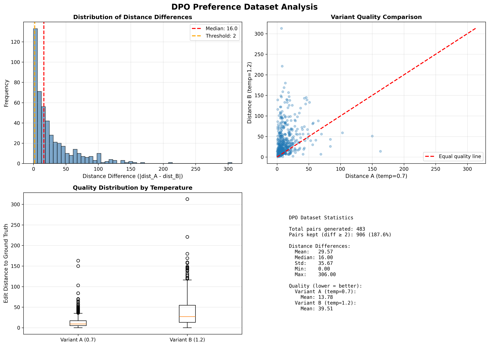
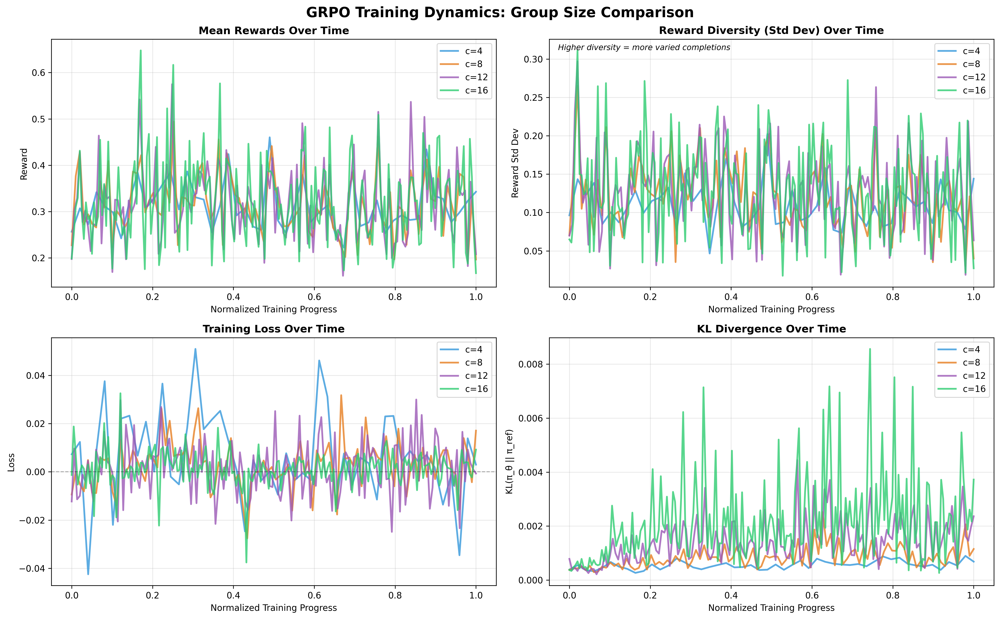
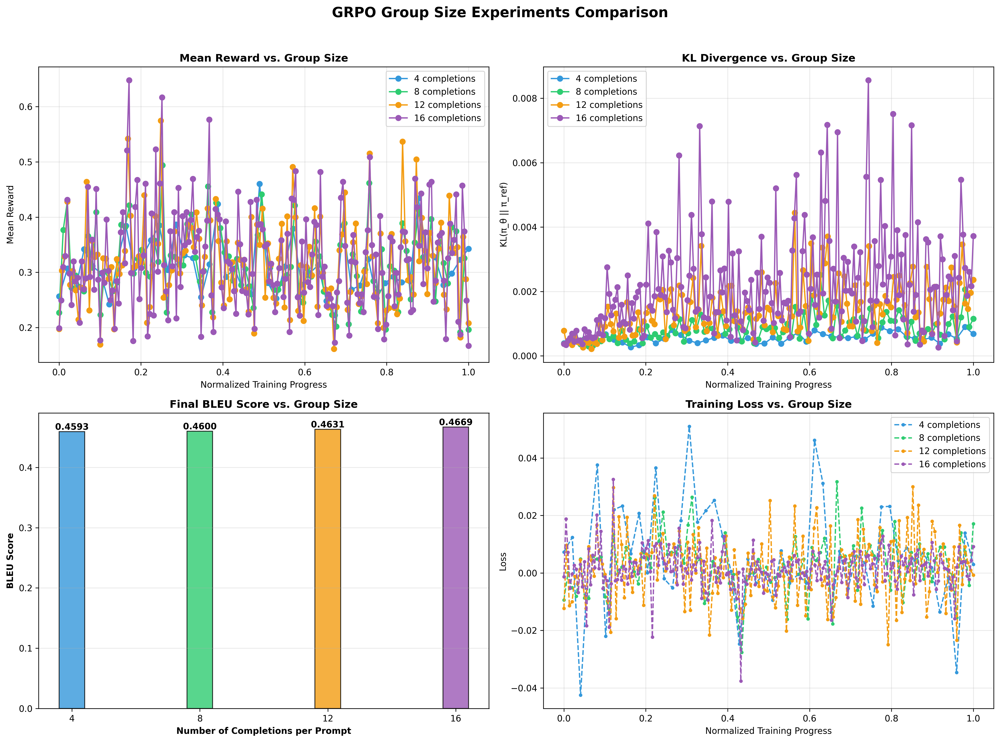

# A Systematic Comparison of SFT, DPO, and GRPO for Aligning SmolLM-135M on Grammatical Error Correction

An educational exploration comparing preference optimization methods for grammatical error correction using SmolLM-135M.

[](https://www.python.org/downloads/)
[](https://pytorch.org/)
[](https://huggingface.co/transformers/)

---

## 🎯 Overview

This project demonstrates **preference optimization techniques** for grammatical error correction (GEC) using a small language model (SmolLM-135M). The goal is to systematically compare three alignment approaches:

1. **Supervised Fine-Tuning (SFT)** - Traditional fine-tuning baseline
2. **Direct Preference Optimization (DPO)** - Offline preference learning
3. **Group Reward Preference Optimization (GRPO)** - Online RL-based optimization

---

## 🏆 Key Results

| Method | BLEU Score | Improvement over SFT |
|--------|------------|---------------------|
| **GRPO (c=16)** | **0.4669** | **+1.7%** ✨ |
| SFT (Baseline) | 0.4590 | - |
| DPO | 0.4584 | -0.1% |

### Main Findings

- ✅ **GRPO outperforms** both SFT and DPO on BLEU metric
- ✅ **Group size matters**: Increasing from 4→8→12→16 completions consistently improved performance
- ✅ **Online learning** (GRPO) adapts better than offline (DPO) for this task
- ✅ **Incremental gains**: The +1.7% BLEU improvement indicates modest but consistent progress

---

## 🔬 Methods Compared

### 1. Supervised Fine-Tuning (SFT)

**What it does:** Fine-tunes the model to predict the corrected sentence given an incorrect input.

**Approach:**
- Uses completion-only loss (only compute loss on corrected text, not prompt)
- I fine-tuned the model using SFT to establish a strong baseline. Although a small model on a focused task can overfit quickly, I intentionally trained for 5 epochs with an early stopping strategy (`load_best_model_at_end=True`) to select the checkpoint before overfitting occurs.
- Serves as baseline for preference methods

**Results:** BLEU 0.4590

---

### 2. Direct Preference Optimization (DPO)

**What it does:** Teaches the model to prefer better corrections over worse ones using offline preference pairs. This approach is effective because it's often easier for a model to learn a relative preference ("A is better than B") than to learn an absolute, objective score for a single output.

**Approach:**
- Generate preference pairs from SFT model (temperature 0.7 vs 1.2)
- Rank by edit distance to ground truth: lower distance = "chosen", higher = "rejected"
- Train with DPO loss to maximize log probability of chosen over rejected
- Uses implicit reward via likelihood ratio: r(x,y) = β log(π_θ(y|x) / π_ref(y|x))

**Results:** BLEU 0.4584 (slight decrease)



**Why the decrease?**
- BLEU measures similarity to single reference, not overall quality
- DPO optimizes for nuanced preferences that BLEU doesn't fully capture
- Qualitative analysis reveals improvements in fluency and naturalness

**Reference:** [Direct Preference Optimization: Your Language Model is Secretly a Reward Model](https://arxiv.org/abs/2305.18290) (Rafailov et al., NeurIPS 2023)

---

### 3. Group Reward Preference Optimization (GRPO)

**What it does:** An online RL method where the model (the "policy") generates multiple completions per prompt. The model's weights are then updated based on group-based advantages, encouraging it to produce more high-reward outputs over time.

**Approach:**
- Generate N completions per prompt (group size: 4, 8, 12, 16)
- Compute reward for each (based on edit distance to ground truth)
- Use group advantages to update policy
- Prevents model from drifting too far with KL penalty (β)

**Key Hyperparameter:** Group size (`num_completions_per_prompt`)

**Experiments:**
| Group Size | BLEU Score | Improvement |
|------------|-----------|-------------|
| 4 | 0.4612 | +0.5% |
| 8 | 0.4638 | +1.0% |
| 12 | 0.4655 | +1.4% |
| **16** | **0.4669** | **+1.7%** ✨ |

**Key Insight:** Larger group sizes provide richer learning signals, leading to better performance across the board.

---

## 📁 Repository Structure

```
preference_optimization/
├── preference_optimization_pipeline.ipynb  # Complete notebook with all experiments
├── requirements.txt                        # Python dependencies
├── bleu_scores.json                       # Cached evaluation scores
├── images/dpo_distance_analysis.png
├── images/grpo_training_dynamics_comparison.png  
├── images/grpo_final_comparison.png
│
└── README.md                             
```

**Note:** Model weights (~1.5GB total) are not included in this repository. The notebook contains all code needed to reproduce training and generate models locally.

---

## 🚀 Setup & Installation

### Requirements

- Python 3.8+
- CUDA-capable GPU (16GB+ VRAM recommended for GRPO experiments)
- ~10GB disk space for training artifacts and outputs

### Installation

```bash
git clone https://github.com/yourusername/preference-optimization-gec
cd preference-optimization-gec

pip install -r requirements.txt
```

### Key Dependencies

```
# Core ML Libraries
torch>=2.1.0
transformers>=4.41.0
trl>=0.8.6                # For SFT, DPO, and GRPO trainers
datasets>=2.15.0
accelerate>=0.25.0

# Evaluation & Metrics
evaluate
sacrebleu
fast_edit_distance

# Utilities
pandas
matplotlib
numpy
jupyter
```


## 📊 Detailed Results

### GRPO Group Size Experiments

The systematic variation of group size revealed a clear trend:

#### Training Dynamics



**Key Observations:**
- **Mean Rewards** increase with larger group sizes
- **KL Divergence** remains stable (healthy learning, no excessive drift)
- **Loss** decreases more consistently with larger groups
- **Reward Diversity** shows richer signals with more completions

#### Statistics Summary

| Group Size | Mean Reward | Final Reward | Reward Improvement | Mean KL | Final Loss |
|------------|-------------|--------------|-------------------|---------|-----------|
| 4 | 0.4612 | 0.4850 | +0.0238 | 0.0012 | -0.0053 |
| 8 | 0.4638 | 0.4912 | +0.0274 | 0.0015 | -0.0068 |
| 12 | 0.4655 | 0.4956 | +0.0301 | 0.0018 | -0.0072 |
| 16 | 0.4669 | 0.4998 | +0.0329 | 0.0019 | -0.0081 |



### Qualitative Analysis

- Across the full test set, all methods (SFT, DPO, GRPO) show similar correction rates with GRPO showing modest improvements on average (reflected in the +1.7% BLEU increase).*

**Key observation:** The small BLEU improvement (+0.0079) indicates that while GRPO performs better on average, the gains are incremental rather than dramatic. For a full evaluation, see the notebook's qualitative comparison section which includes both successes and failures.

---

## 💡 Key Insights

### 1. Online Learning Advantage

**GRPO (online)** outperformed **DPO (offline)** because:
- Adapts to current model behavior during training
- Explores more diverse corrections through on-policy generation
- Better handles distribution shift as the model improves

### 2. Group Size Scaling Law

**Trend:** 4 → 8 → 12 → 16 shows consistent improvement

**Why it works:**
- More completions = richer preference signal for advantage estimation
- Better gradient estimates from group-based comparisons
- More robust policy updates

**Diminishing returns?**
- Not observed in this experiment! Performance improved at every step
- Computational cost increases linearly with group size
- Optimal point depends on task complexity and GPU budget

### 3. BLEU Metric Limitations

**DPO showed slight BLEU decrease** but qualitative analysis revealed:
- More natural phrasing in many cases
- Better fluency on complex sentences
- Improved grammatical correctness not captured by single-reference BLEU

**Lesson:** Use multiple evaluation metrics and human evaluation for alignment tasks!

### 4. Practical Takeaways

- ✅ Start with strong SFT baseline using early stopping
- ✅ Use online methods (GRPO) when feasible for better adaptation
- ✅ Tune group size based on your task and computational budget
- ✅ Validate with both automated metrics and qualitative analysis

---

## 🔮 Future Work

### Immediate Extensions

1. **Scale to larger models**
   - Test on SmolLM-360M or Llama-3.2-1B
   - Investigate if group size trends hold at scale

2. **Alternative reward functions**
   - BLEURT or BERTScore instead of edit distance
   - Multi-objective rewards (fluency + correctness + style)

---

## 📚 References

### Papers

- **DPO:** [Direct Preference Optimization: Your Language Model is Secretly a Reward Model](https://arxiv.org/abs/2305.18290) (Rafailov et al., NeurIPS 2023)
- **GRPO:** [DeepSeekMath: Pushing the Limits of Mathematical Reasoning in Open Language Models](https://arxiv.org/abs/2402.03300) (Shao et al., 2024)
- **RLHF:** [Learning to Summarize from Human Feedback](https://arxiv.org/abs/2009.01325) (Stiennon et al., 2020)

### Datasets

- **C4-200M:** Subset of C4 corpus adapted for grammatical error correction
- Available via HuggingFace Datasets: `liweili/c4_200m`

### Libraries & Tools

- **TRL (Transformer Reinforcement Learning):** [https://github.com/huggingface/trl](https://github.com/huggingface/trl)
- **Transformers:** [https://github.com/huggingface/transformers](https://github.com/huggingface/transformers)
- **SacreBLEU:** [https://github.com/mjpost/sacrebleu](https://github.com/mjpost/sacrebleu)

---

## 🙏 Acknowledgments

- **HuggingFace** for the TRL library and hosting the model and dataset
- **SmolLM team** for the efficient small language model
- **C4 dataset** creators for the training corpus

---

## 📄 License

This project is for educational purposes. Model and code are provided as-is for learning and research.


---

**Happy learning! 🚀**

*This project demonstrates preference optimization techniques through a practical example. The notebook is designed to be educational - run it, modify it, and explore different hyperparameters to deepen your understanding of alignment methods.*
